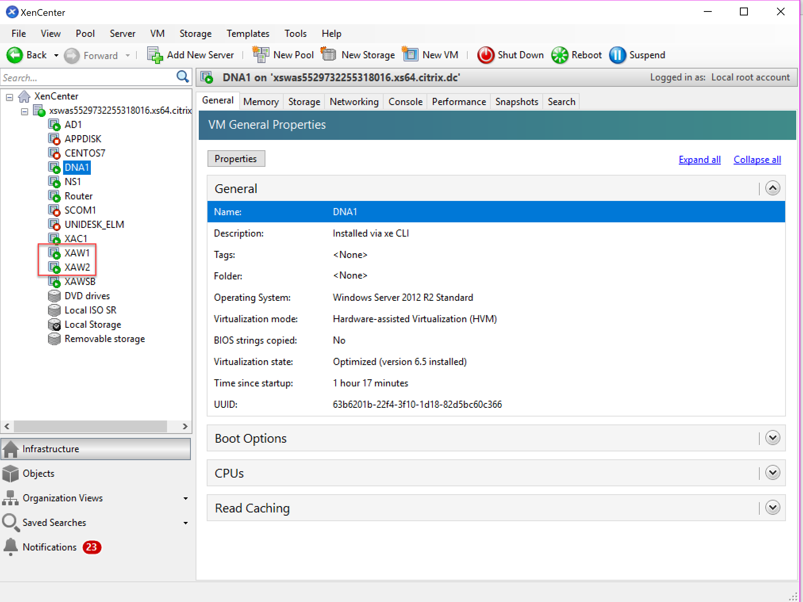
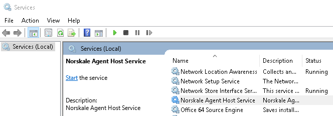
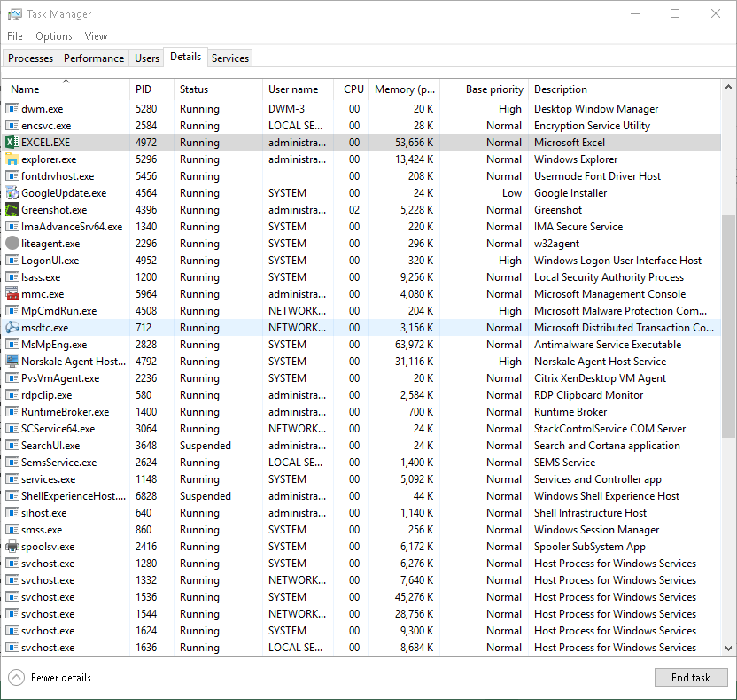

# Module 1 #

In this Module for Workspace Environment Manager, you will test the default settings for CPU and RAM optimization of the WEM Agents.

## Configure WEM optimizations and run test scenarios ##

Connect to one of the XAWx servers (XAW1 or XAW2)

**NOTE:** The following steps are only designed for a POC or dev environment, not in production.

Download the "WEM-Examples.zip" file from GitHub and copy all files in the archive into a local temp folder, for example the “Documents” folder

**CPU idle step:**
Launch services.msc and stop Norskale Agent Host service in order to stop WEM optimizations. 

Launch WEM POC results.xlsx from your Documents folder

To avoid any Windows optimization side effects, launch and close each of the example files twice: 

- My Excel File.xlsx
- Test page with Chrome
- Test Page with Internet Explorer
- Workspace Environment Management_Technical_1.0.pptx
- XenDesktop Reviewer's Guide_Blade.docx

Use your smartphone to measure the “launch time” for each example file: time between the enter key stroke to the launch of the file, and time when the application is ready to use.

Open WEM POC result.xlsx previously copied in the documents folder
Go to the CPU tab.
Fill rounded numbers in the results excel file, on the first column:
 
- 100% CPU used, without optimizations step:
- Keep WEM service stopped,
- Right-click on the taskbar and launch Task Manager

From Windows Explorer, launch cpueater.exe from the folder you copied the Example files into

Click the On button, and check on Task Manager that the CPU is “eaten”

Use your smartphone to measure “launch time” for each example file: time between enter key stroke to launch the file and the time when the application is ready to use.

Click Off on CPUeater
Fill rounded numbers in the results excel file, on the second column:
 
100% CPU used, with optimization step:

Start services.msc and start Norskale Agent Host Service

 
Launch cpueater.exe
 
Click the On button, and check on Task Manager that the CPU is “eaten”

Use your smartphone to measure “launch time” for each example file: time between enter key stroke to the launch of the file and time when the application is ready to use.

Click Off on CPUeater
Fill in the rounded numbers in the results excel file, on the third column:
 
In the first part of the exercise, you have verified WEM CPU optimization benefits. Even though CPU was maxed out, we maintained the best possible performance level for end user activity.
This feature will be key to add more users on XenApp servers and maintain very good application responsiveness.
This step by step scenario can be easily done in a POC with customers.

**RAM optimizations:**

Close every sample application, and launch “My Excel File.xlsx”
Check immediately memory size on Task Manager, Details tab, Memory column:

 
Go to the RAM tab of “WEM POC results.xlsx” and fill this rounded number in MB, in this first column:
 
Redo same steps in point16 for every sample application:

- “Test page with Chrome” (add every Chrome process)
- “Test Page with Internet Explorer” (add every IE process)
- “Workspace Environment Management_Technical_1.0.pptx”
- “XenDesktop Reviewer's Guide_Blade.docx”

Report numbers in the RAM tab of “WEM POC results.xlsx”,
Wait for up to 5 minutes, without using these applications: WEM agent detects application activity, and do not apply any RAM optimization to “in use” application.
After at least five minutes, check the memory size of the applications running in task manager, and report the new numbers in the RAM tab of “WEM POC results.xlsx”
 
Memory footprint of running applications, but idle, has been deeply reduced.

These optimizations will apply to any running process and give an overall RAM usage reduction from 20% up to 50% on any Windows process

Bring Internet Explorer back into focus. 
Check there is no latency in accessing the optimized application and has good responsiveness. 
Check the memory size again in task manager and report new numbers in the RAM tab of “WEM POC results.xlsx”
 